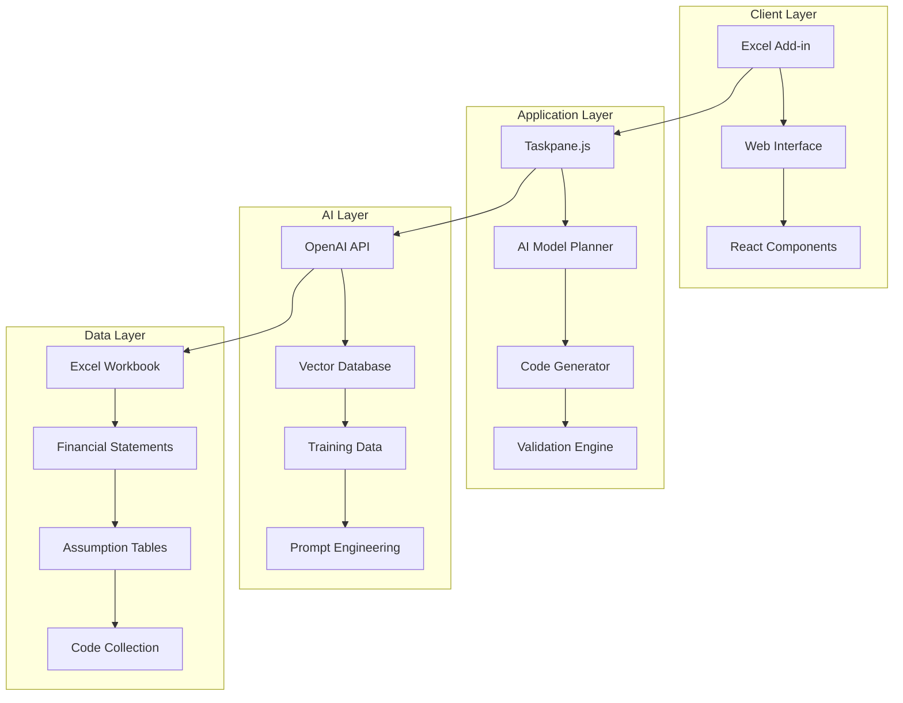

# Projectify5.0 - Professional Financial Modeling with AI


## Table of Contents

1. [Overview](#overview)
2. [Architecture](#architecture)
3. [Components](#components)
4. [Installation & Setup](#installation--setup)
5. [Usage Guide](#usage-guide)
6. [Financial Model Encoder System](#financial-model-encoder-system)
7. [Training Data System](#training-data-system)
8. [API Documentation](#api-documentation)
9. [Development Guide](#development-guide)
10. [Troubleshooting](#troubleshooting)
11. [Contributing](#contributing)
12. [License](#license)

## Overview

Projectify5.0 is an advanced financial modeling platform that combines Microsoft Excel add-in technology with AI-powered model generation. It enables investment bankers, financial analysts, and business professionals to create sophisticated 3-statement financial models using natural language inputs and a proprietary coding system.

### Key Features

- **AI-Powered Model Generation**: Create financial models using natural language prompts
- **Excel Integration**: Native Excel add-in with custom functions and ribbon commands
- **Proprietary Codestring Language**: Structured financial modeling language for precise calculations
- **3-Statement Models**: Automatically generates Income Statement, Balance Sheet, and Cash Flow Statement
- **Training Data System**: Continuous improvement through user feedback and training data collection
- **Vector Database Integration**: Pinecone-powered similarity search for relevant model templates
- **Web Interface**: Modern React-based interface for model planning and subscription management
- **Authentication**: Microsoft Azure AD integration for secure user access

### Target Users

- Investment Banking Analysts
- Financial Planning & Analysis (FP&A) Professionals
- Corporate Finance Teams
- Business Consultants
- Financial Modeling Instructors and Students

## Architecture



## Components

### 1. Excel Add-in (`src/`)

The core Excel add-in provides:

- **Taskpane Interface**: Main user interface within Excel
- **Custom Functions**: Excel functions for financial calculations
- **Ribbon Commands**: Quick access buttons in Excel ribbon
- **VBA Integration**: Legacy VBA script support for advanced features

**Key Files:**
- `src/taskpane/taskpane.js` - Main application logic
- `src/functions/functions.js` - Custom Excel functions
- `src/commands/commands.js` - Ribbon command handlers
- `manifest.xml` - Add-in configuration

### 2. Web Interface (`Loveable/`)

React-based web application for:

- **Chat Interface**: Natural language model creation
- **Subscription Management**: User plan management
- **Model Planning**: Interactive model structure planning

**Key Files:**
- `Loveable/ebitdai-ai-excel-wizard-main/src/pages/Index.tsx` - Main page
- `Loveable/ebitdai-ai-excel-wizard-main/src/components/ChatPanel.tsx` - Chat interface
- `Loveable/ebitdai-ai-excel-wizard-main/src/components/SubscriptionPanel.tsx` - Subscription management

### 3. AI System (`src/prompts/`)

Comprehensive prompt engineering system:

- **Encoder System**: Converts natural language to codestrings
- **Model Planner**: Guides users through model creation
- **Validation System**: Ensures model accuracy and consistency
- **Training Data Management**: Collects and manages training examples

**Key Files:**
- `src/prompts/Encoder_System.txt` - Core financial model encoder
- `src/prompts/AIModelPlanning_System.txt` - AI model planning assistant
- `src/prompts/Validation_System.txt` - Model validation system
- `src/prompts/Followup_System.txt` - Follow-up conversation handler

### 4. Training Data System

Machine learning pipeline for continuous improvement:

- **Training Data Queue**: Collects user interactions for model training
- **Vector Database**: Stores and retrieves relevant model templates
- **Prompt Modules**: Specialized prompts for different financial scenarios

**Key Files:**
- `TRAINING_QUEUE_FEATURE.md` - Training data collection system
- `src/prompts/Prompt_Modules/` - Specialized financial modeling prompts
- `assets/codestringDB.txt` - Code string database

## Installation & Setup

### Prerequisites

- Node.js (v16 or later)
- Microsoft Excel (2016 or later)
- Microsoft Azure account (for authentication)
- OpenAI API key
- Pinecone API key

### Step 1: Clone the Repository

```bash
git clone <repository-url>
cd Projectify5.0
```

### Step 2: Install Dependencies

```bash
npm install
```

### Step 3: Environment Configuration

Create a `.env` file in the root directory:

```env
OPENAI_API_KEY=your_openai_api_key_here
PINECONE_API_KEY=your_pinecone_api_key_here
NODE_ENV=development
```

### Step 4: Azure Authentication Setup

Follow the [Microsoft Authentication Setup Guide](MICROSOFT_AUTH_SETUP.md) to configure Azure AD authentication.

### Step 5: Build the Add-in

```bash
# Development build
npm run build:dev

# Production build
npm run build
```

### Step 6: Start Development Server

```bash
npm run dev-server
```

### Step 7: Sideload the Add-in

1. Open Excel
2. Go to Insert > My Add-ins > Upload My Add-in
3. Select `manifest.xml` from the project root
4. The add-in will appear in the ribbon

## Usage Guide

### Basic Workflow

1. **Open Excel** and activate the Projectify5.0 add-in
2. **Choose Mode**: Select either Developer Mode or Client Mode
3. **Describe Your Model**: Use natural language to describe your financial scenario
4. **Review Model Plan**: The AI will generate a structured model plan
5. **Generate Code**: Convert the plan into executable codestrings
6. **Build Model**: Execute the code to create Excel worksheets and formulas
7. **Validate Results**: Review and validate the generated financial model

### Developer Mode Features

- **AI Model Planning**: Advanced model planning with detailed assumptions
- **Code Generation**: Direct codestring generation and editing
- **Training Data Management**: Collect and manage training examples
- **Validation Tools**: Comprehensive model validation and error checking

### Client Mode Features

- **Simplified Interface**: Streamlined model creation process
- **Guided Planning**: Step-by-step model structure planning
- **Subscription Management**: Plan selection and billing management

### Example Usage

```javascript
// Example: Creating a SaaS Revenue Model
const prompt = `
I have a SaaS business with:
- Monthly subscription price: $50
- Current subscribers: 1000
- Monthly churn rate: 5%
- New customer acquisition: 100 per month
- Customer acquisition cost: $200
`;

// The AI will generate appropriate codestrings like:
// <CONST-E; row1="V1(D)|Monthly Price per User(L)|(F)|(C1)|(C2)|(C3)|(C4)|(C5)|$50(C6)|~$50(Y1)|~$50(Y2)|...">
// <SPREAD-E; row1="V2(D)|New Customers(L)|(F)|(C1)|(C2)|(C3)|(C4)|(C5)|(C6)|100(Y1)|100(Y2)|...">
```

## Financial Model Encoder System

### Codestring Language

The proprietary codestring language consists of:

- **Seed Codes**: Foundation elements (CONST-E, SPREAD-E, ENDPOINT-E)
- **Math Operators**: Calculation functions (MULT2-S, DIVIDE2-S, SUBTOTAL2-S)
- **Organizational Codes**: Structure elements (LABELH1, LABELH2, BR)
- **Formula Codes**: Custom formula implementation (FORMULA-S)

### Example Codestring

```javascript
<CONST-E; row1="V1(D)|Monthly Price(L)|(F)|(C1)|(C2)|(C3)|(C4)|(C5)|$50(C6)|~$50(Y1)|~$50(Y2)|~$50(Y3)|~$50(Y4)|~$50(Y5)|~$50(Y6)|">
```

**Breakdown:**
- `CONST-E`: Seed code for constant values
- `V1(D)`: Output driver (V1)
- `Monthly Price(L)`: Label column
- `(F)`: FinCode column (for financial statement mapping)
- `(C1)-(C6)`: Fixed assumption columns
- `(Y1)-(Y6)`: Annual assumption columns
- `$50`: Dollar-formatted value
- `~$50`: Italicized dollar value (for rates)

### Financial Statement Integration

Models automatically generate:

1. **Income Statement**: Revenue, expenses, and profit calculations
2. **Balance Sheet**: Assets, liabilities, and equity
3. **Cash Flow Statement**: Operating, investing, and financing cash flows

### FinCode Mapping

```javascript
// Income Statement Codes
"IS: revenue"           // Revenue line items
"IS: direct costs"      // Cost of goods sold
"IS: corporate overhead" // Operating expenses
"IS: d&a"              // Depreciation & amortization
"IS: interest expense"  // Interest payments
"IS: other income"      // Non-operating income

// Balance Sheet Codes
"BS: current assets"    // Cash, receivables, inventory
"BS: fixed assets"      // Property, plant, equipment
"BS: current liabilities" // Short-term debt, payables
"BS: lt liabilities"    // Long-term debt
"BS: equity"           // Shareholders' equity

// Cash Flow Codes
"CF: wc"               // Working capital changes
"CF: non-cash"         // Non-cash items
"CF: cfi"              // Capital expenditures
"CF: cff"              // Financing activities
```

## Training Data System

### Data Collection

The system continuously collects training data through:

1. **User Interactions**: Prompts and generated models
2. **Validation Feedback**: Error corrections and improvements
3. **Manual Curation**: Expert-reviewed examples

### Training Data Queue

```javascript
// Add to training queue
function addToTrainingDataQueue() {
    const prompt = getUserPrompt();
    const codestring = getSelectedCode();
    
    const entry = {
        prompt: prompt,
        selectedCode: codestring,
        timestamp: new Date().toISOString()
    };
    
    saveToQueue(entry);
    downloadCSV(entry);
}
```

### Vector Database Integration

Uses Pinecone for:
- **Similarity Search**: Find relevant model templates
- **Contextual Retrieval**: Retrieve training examples based on user input
- **Continuous Learning**: Improve model accuracy over time

## API Documentation

### Core Functions

#### `processModelCodesForPlanner(modelCodesString)`
Processes model codes for the AI planner.

**Parameters:**
- `modelCodesString`: String containing model codes

**Returns:**
- Promise resolving to processed model structure

#### `handleConversation(userInput, conversationHistory)`
Handles AI conversation flow.

**Parameters:**
- `userInput`: User's natural language input
- `conversationHistory`: Array of previous conversation messages

**Returns:**
- Promise resolving to AI response

#### `validateCodeStringsForRun(codeStrings)`
Validates codestrings before execution.

**Parameters:**
- `codeStrings`: Array of codestring objects

**Returns:**
- Validation result object with errors and warnings

### Excel Integration Functions

#### `runCodes(codeStrings)`
Executes codestrings in Excel.

**Parameters:**
- `codeStrings`: Array of validated codestrings

**Returns:**
- Promise resolving to execution results

#### `populateCodeCollection(codes)`
Populates the code collection for Excel integration.

**Parameters:**
- `codes`: Array of codestring objects

**Returns:**
- Populated code collection

## Development Guide

### Project Structure

```
Projectify5.0/
├── src/                    # Excel add-in source code
│   ├── taskpane/          # Main application logic
│   ├── functions/         # Custom Excel functions
│   ├── commands/          # Ribbon commands
│   ├── prompts/           # AI prompt templates
│   └── server/            # Development server
├── Loveable/              # Web interface
│   └── ebitdai-ai-excel-wizard-main/
│       ├── src/           # React components
│       ├── public/        # Static assets
│       └── package.json   # Web dependencies
├── assets/                # Images and data files
├── manifest.xml           # Add-in manifest
├── package.json           # Main dependencies
└── webpack.config.js      # Build configuration
```

### Development Scripts

```bash
# Start development server
npm run dev-server

# Build for production
npm run build

# Start Excel debugging
npm run start

# Stop Excel debugging
npm run stop

# Validate manifest
npm run validate

# Run file server
npm run file-server
```

### Adding New Features

1. **New Codestring Types**: Add to `src/prompts/Encoder_System.txt`
2. **UI Components**: Add to `src/taskpane/taskpane.html` and `taskpane.js`
3. **Validation Rules**: Update `src/taskpane/Validation.js`
4. **Training Prompts**: Add to `src/prompts/Prompt_Modules/`

### Testing

```bash
# Run validation tests
npm run lint

# Test add-in functionality
npm run start

# Debug in Excel
F12 Developer Tools in Excel
```

## Troubleshooting

### Common Issues

#### Add-in Not Loading
- **Cause**: Manifest file issues or certificate problems
- **Solution**: Validate manifest with `npm run validate`

#### API Key Errors
- **Cause**: Missing or invalid OpenAI/Pinecone API keys
- **Solution**: Check `.env` file and environment variables

#### Excel Formula Errors
- **Cause**: Invalid codestring generation
- **Solution**: Use validation system before running codes

#### Authentication Issues
- **Cause**: Azure AD configuration problems
- **Solution**: Follow [Microsoft Authentication Setup Guide](MICROSOFT_AUTH_SETUP.md)

### Debug Mode

Enable debug mode by setting:
```javascript
const DEBUG = true;
```

This provides:
- Detailed console logging
- Error stack traces
- Performance metrics
- API call monitoring

### Error Handling

The system includes comprehensive error handling:

- **Parameter Validation**: Checks for required inputs
- **Excel API Errors**: Handles Office.js failures
- **AI API Errors**: Manages OpenAI/Pinecone timeouts
- **User Input Errors**: Validates user inputs before processing

## Contributing

### Development Setup

1. Fork the repository
2. Create a feature branch
3. Make your changes
4. Test thoroughly
5. Submit a pull request

### Code Style

- Follow ESLint configuration
- Use TypeScript for new components
- Document all functions
- Include error handling

### Testing Guidelines

- Test Excel integration thoroughly
- Validate AI responses
- Check edge cases
- Verify cross-browser compatibility

## License

MIT License - see LICENSE file for details.

---

## Support

For technical support or questions:
- Email: support@projectify.com
- Documentation: https://docs.projectify.com
- GitHub Issues: https://github.com/projectify/issues

## Changelog

### Version 5.0.0
- Complete system rewrite with React web interface
- Enhanced AI model planning capabilities
- Improved training data collection system
- Better error handling and validation
- Microsoft Azure AD integration

### Version 4.0.0
- Added vector database integration
- Implemented codestring validation system
- Enhanced prompt engineering
- VBA script integration improvements 